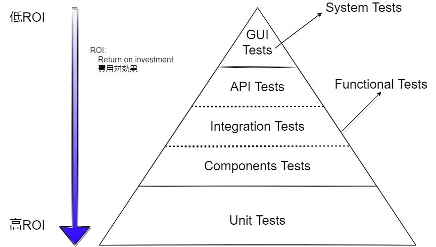
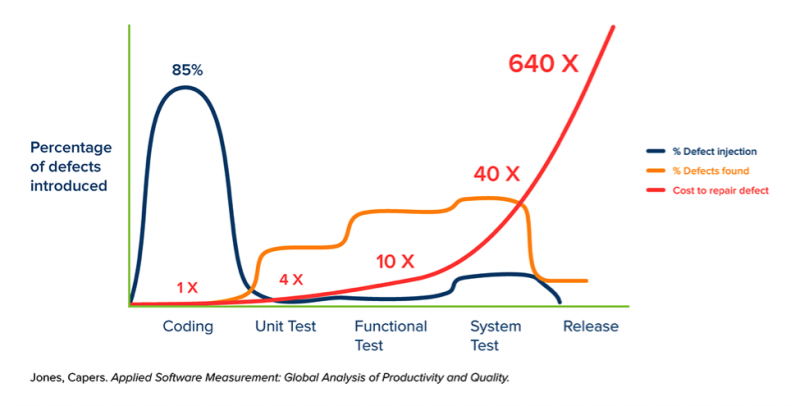
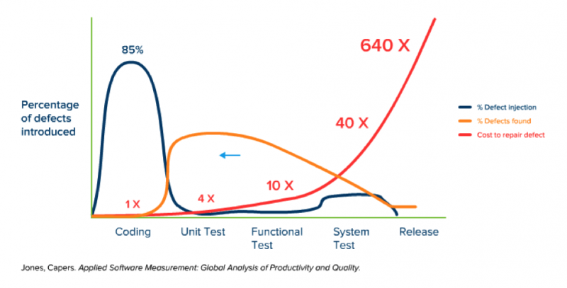
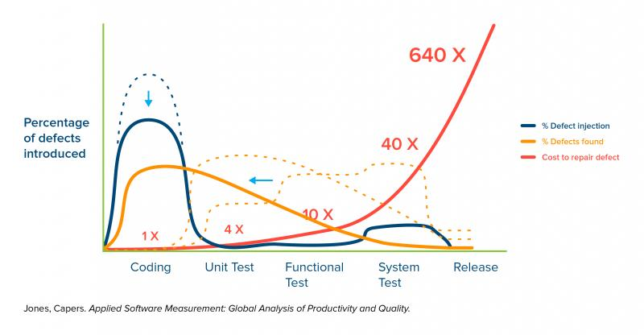

# 単体テストとは
https://www.techmatrix.co.jp/t/quality/unittest.html

- 単体テスト（ユニットテストと呼ばれることもあります）は、プログラムを構成する比較的小さな単位（ユニット）が個々の機能を正しく果たしているかどうかを検証するテストです。

- 通常、関数やメソッドが単体テストの単位（ユニット）となります。 
- プログラムが全体として正しく動作しているかを検証する結合テストは、開発の比較的後の段階でQAチームなどによって行なわれることが多いのとは対照的に、単体テストは、コード作成時などの早い段階で開発者によって実施されることが多いのが特徴です。

 

## 単体テストの重要性
- ソフトウェア開発における定量化研究の先駆者であり、ソフトウェア品質の第一人者、​ケイパーズ・ジョーンズ（Capers Jones）氏
https://www.stickyminds.com/article/shift-left-approach-software-testing

### The Shift-Left Approach to Software Testing

#### 不具合の発生と発見、修正に対するコストの可視化
- 紺：不具合(defects)が入る場所
- 橙：不具合(defects)を見つける場所
- 赤：不具合修正にかかるコスト

- 上位のテスト（GUIテスト、APIテスト）ほど準備に時間がかかり、不具合発生時に問題の特定に時間家かかってしまう

#### Shift-Left Approach
- 不具合の発見をできるだけ左側とすることで、対策コストを下げることができる
- 上位のテスターは品質担保のため、より多くの種類のテストを行うことができる

- 静的コード解析や、ユニットテスト強化などの初期段階の開発手法を実行すると、プロセスの早い段階で欠陥を特定して防止するのに役立ちます。
- 目標はバグを見つけることではなく、バグ、特にリリースに含まれるバグの数を減らすことであることを覚えておくことが重要です。最終的に、最初に作成するバグの数を減らすことは、バグを増やすよりもはるかに価値があり、はるかに安価です。

## 単体テストのプログラム化（テストコード）の利点

- Shift-Left Approachの通り、できるだけコーディングに近いところで、何度もテストを行うことが、低コスト、高品質で機能を提供するポイントとなる

- 手作業で単体テストを繰り返すには限界があるため、テスト自体をコード化することで、テスト自体の高速化・自動化を図り、テスト回数を増やし品質を高めることができる

## 【参考】TDD : Test-Driven Development （テスト駆動プログラミング）
- ソフトウェア開発の手法の一つで、プログラム本体より先にテストコードを書き、そのテストに通るように本体のコードを記述していく方式。
- あくまで手法の一つであるため、全ての開発で採用すべき話ではない。この考え方から自分達に合う、かつ実施可能なことの範囲と目標を決め、実践する為の指針すべき

Robert C.Martin著 [clean code](https://www.amazon.co.jp/Clean-Code-%E3%82%A2%E3%82%B8%E3%83%A3%E3%82%A4%E3%83%AB%E3%82%BD%E3%83%95%E3%83%88%E3%82%A6%E3%82%A7%E3%82%A2%E9%81%94%E4%BA%BA%E3%81%AE%E6%8A%80-Robert-C-Martin/dp/4048930591)

### TDD(テスト駆動型プログラム)の3法則

- First Law : 失敗するテストコードがない限り、プロダクシンコードは書いてはいけない。
- Second Law : 失敗する以上のテスト書いてはいけません。
- Third Law : テストを通る以上のコード書いてはいけません。

### 上記の3法則を守ると
- 数十秒毎にテストコードとプロダクションコードの間に行き来することになる。
- テストコードとプロダクションコードが同時に出来上がる。
- テストコードがプロダクションコードを大体カバーすることになる。

### TDDのメリット
- テストを先に考える＝【何をしたいかを先に考える、または使い方を先に考える】
- テスト可能なコードを書こうとすると、自然に再利用可能(コンポネント)、柔軟、きれないなプロダクションコードが出来上がる
- コードはとてもシンプルに出来上がる。
    - よくある、担当分けして(俺がPersonクラスを、彼がSubjectクラスを、あなたがSenseiクラスを作ろう。みたいな話をしてから実装に入ることは大体ソース無駄に複雑にすることが多い。TDDで素直にやりたいことを先に考えてやればとてもシンプルなコードになるケースが多い)
    もちろん、そういうケースを完全に否定している分けではありません。

- あとからテストコードを検討するより、より短い時間でテストコードを作成できる
    - プロダクションコードを書きながらテストコードを書くため、脳の切り替えがスムーズ
    - カバレッジの高いテストコードをより早くかける

- カバレッジが高いと変更に対する恐怖が減るため、プロダクションコードの改修がしやすい
    - カバレッジが高い = 必ずしも、バグがないというわけではありません。
    - カバレッジは85%位を目指そうと、多くの著名人が言っています。

### 所感
- 実際にTDDを行うのは非常に大変。
    - プロダクションコードが進まない焦り
    - 進もうとしてもブロックされるような感覚
- しかしプロダクションコードを書いてから、テストコードを書くとテストコードが非常に`かきづらい`場面に合うことがある
- こういった場合は、プロダクションコードに無駄/読みにくさがある状態
- TDDを実践しなくとも、テストコードがかけるか？の考えを持ちながらプロダクションコードを書くのが良い