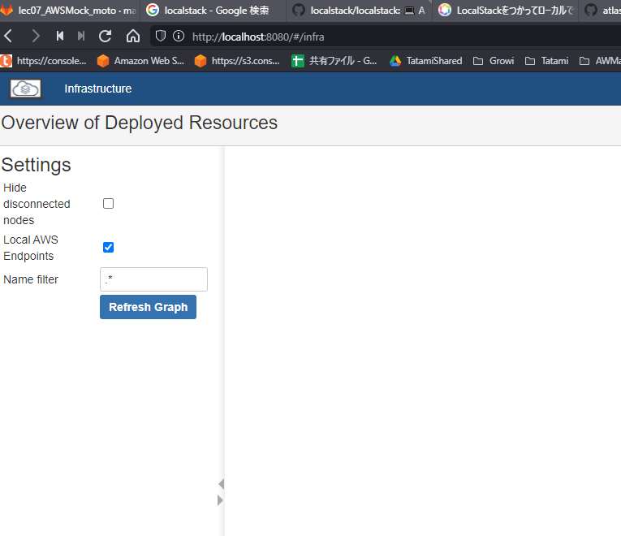
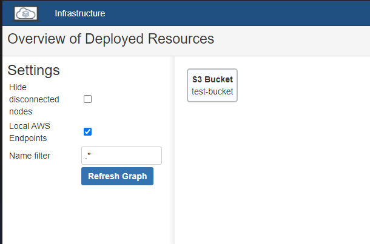

# Localstack
## Localstackとは
- 最高のmock/テストツール（公式サイトいわく）
- ローカルマシンなどの開発環境にAWSサービスを擬似的に再現するモックサービス

    公式サイト：https://github.com/atlassian/localstack.git


- テストコードを書くというより、擬似的なAWSサービスを実際に動作させてテストする


## Localstackの環境構築
- 公式サイトにはいくつか手順があるが、ここでは一番簡単なdocker-composeで解説
- `git clone`して`docker-compose up`で立ち上げる
```
$ git clone https://github.com/atlassian/localstack.git
$ cd localstack
$ docker-compose up
```

- 立ち上がるとダッシュボードにアクセスできる    
    http://localhost:8080
    
    
    
## Localstackリソースへのアクセス
- Localstack用のプロファイルを作成する
    - Access Key、SecretAccessKeyなどは適当でいい
    
    ```shell script
    $ aws configure --profile localstack
    AWS Access Key ID [None]: dummy
    AWS Secret Access Key [None]: dummy
    Default region name [None]: us-east-1
    Default output format [None]: text
    ```
  
  
 - CLIで適当にS3バケットを作ってみる
    - `--endpoint-url=`オプションで、エンドポイントをLocalstackに向ける
    - サービス毎にポート番号が異なるため、公式ドキュメントを確認する
    - S3の場合は `--endpoint-url=http://localhost:4572`
    
    ```shell script
    # バケット作成
    $ aws s3 mb s3://test-bucket --endpoint-url=http://localhost:4572 --profile=localstack
    make_bucket: test-bucket
   
    # バケット確認
    $ aws s3 ls --endpoint-url=http://localhost:4572 --profile=localstack
    2006-02-04 01:45:09 test-bucket
    ```
    
    
 
### 環境用意後
- エンドポイントを各サービス毎で指定しながらリソースを作成、テストしていく
    - API Gateway at http://localhost:4567
    - Kinesis at http://localhost:4568
    - DynamoDB at http://localhost:4569
    - DynamoDB Streams at http://localhost:4570
    - Elasticsearch at http://localhost:4571
    - S3 at http://localhost:4572
    - Firehose at http://localhost:4573
    - Lambda at http://localhost:4574
    - SNS at http://localhost:4575
    - SQS at http://localhost:4576
    - Redshift at http://localhost:4577
    - ES (Elasticsearch Service) at http://localhost:4578
    - SES at http://localhost:4579
    - Route53 at http://localhost:4580
    - CloudFormation at http://localhost:4581
    - CloudWatch at http://localhost:4582

- 接続パターン
```python
import boto3
from boto3.session import Session

session = Session(aws_access_key_id='dummmy',
                  aws_secret_access_key='dummmy',
                  region_name='<REGION NAME>')

s3 = session.resource(
    service_name='s3', 
    endpoint_url='http://localhost:4572'
```    