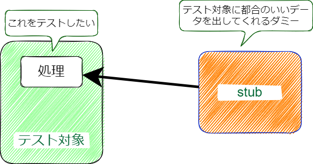

# botocore.stub.Stubber

  
    
## （おさらい）stubとは？
- テストに必要なデータをダミーで生成してくれるもの
    - 定義上mockとは異なるが、ダミーをしてくれるという点では同じ

    
    
    

## botocore.stub.Stubberとは
- PythonのAWS SDKであるboto3ライブラリ内で提供されているAWS操作用スタブ
- 公式サイト    
    https://botocore.amazonaws.com/v1/documentation/api/latest/reference/stubber.html
- 2021年07月現在、日本語で読めるドキュメントは存在しない
    - [AWS SDK for Ruby　の公式ドキュメント](https://docs.aws.amazon.com/ja_jp/sdk-for-ruby/v3/developer-guide/stubbing.html) が唯一近いものとなる
    
## botocore.stub.Stubberの使い所
- `moto`や`localstack`では再現できないテストの場合、botocore.stub.Stubberを使う
    - `moto`、`localstack`が未サポートなAWSサービス
    - 強制的にAWS SDK（Boto3）から例外を出させる場合など
    
### メリット
* 制御: Stubberは、特定のメソッド呼び出しに対するレスポンスを正確に制御ができる。これにより、特定のシナリオやエラー条件をシミュレートすることが容易となる。
* 単純さ: Stubberは比較的単純で直感的なAPIを持っており、使い始めるのは簡単
* 依存関係のなさ: Stubberはbotocoreに組み込まれており、追加の依存関係を必要としない

### デメリット
* 手動設定: Stubberを使用すると、各メソッド呼び出しに対する期待されるレスポンスを手動で設定する必要があります。これは、テストのセットアップが自分ですべて作る必要がある
* 実装の不整合: motoやlocalstackはAWSサービスの動作をエミュレートするため、実際のAWSサービスの動作に近いテストを提供する可能性があります。一方、Stubberは手動で設定されたレスポンスを提供するため、実際のサービスの動作と異なる可能性がある。


### 使い所
- 基本は`moto`や`localstack`を使う。
- サポートしていない場合のみ`botocore.stub.Stubber` を使う


## Stubberの基本的な使用方法:

1. **インストール**:
   `boto3`と`botocore`は通常一緒にインストールされます。確認のために、以下のコマンドを実行できます。
   ```bash
   pip install boto3 botocore
   ```

2. **クライアントの作成**:
   `boto3`を使用して、テストするAWSサービスのクライアントを作成します。
   ```python
   import boto3

   client = boto3.client('s3')
   ```

3. **Stubberの作成**:
   `botocore.stub.Stubber`を作成し、AWSサービスのクライアントを渡します。
   ```python
   from botocore.stub import Stubber

   stubber = Stubber(client)
   ```

4. **レスポンスの追加**:
   `Stubber`に追加したいレスポンスを指定します。これは、AWSサービスのクライアントメソッドが返すべきレスポンスを定義します。
   ```python
   response = {'Buckets': [{'Name': 'my-bucket'}]}
   expected_params = {}
   stubber.add_response('list_buckets', response, expected_params)
   ```

5. **Stubberのアクティベーション**:
   `Stubber`をアクティベートして、モック化されたレスポンスを使用する準備をします。
   ```python
   stubber.activate()
   ```

6. **コードのテスト**:
   コードを呼び出し、期待される動作をアサートします。
   ```python
   result = client.list_buckets()
   assert result['Buckets'][0]['Name'] == 'my-bucket'
   ```

7. **Stubberのデアクティベーション**:
   テストが完了したら、`Stubber`をデアクティベートしてクリーンアップします。
   ```python
   stubber.deactivate()
   ```

### サンプル実装:

以下は、`Stubber`を使用して`boto3`のS3クライアントメソッドをモック化するサンプル実装です。

- テスト対象。S3をリストバケットする関数
```python
import boto3

def list_s3_buckets():
    client = boto3.client('s3')
    response = client.list_buckets()
    
    return [bucket['Name'] for bucket in response['Buckets']]
```

- テストコード
```python
import boto3
import pytest
from botocore.stub import Stubber

def test_list_s3_buckets():
    client = boto3.client('s3')
    stubber = Stubber(client)

    # 自身でレスポンスの内容を作成
    mock_response = {'Buckets': [{'Name': 'my-bucket'}]}
    stubber.add_response('list_buckets', mock_response)

    # Stubberをアクティベート
    stubber.activate()

    # テスト対象の関数を呼び出し
    buckets = list_s3_buckets()

    # アサーション
    assert buckets == ['my-bucket']

    # Stubberをデアクティベート
    stubber.deactivate()
```

このサンプル実装では、`list_s3_buckets`関数が`boto3`のS3クライアントを使用してバケットのリストを取得し、それらの名前を返すことを確認しています。`Stubber`は、`list_buckets`メソッドの呼び出しをモック化し、指定されたモックレスポンスを返します。


-----------------------------

## （他の例）botocore.stubの使い方のイメージ
```python
# EC2 の情報をdescribeする処理o
import boto3

ec2 = boto3.client('ec2')
responce = ec2.describe_instances()
```

- この `describe_instances()`関数の返り値を好きなダミーに書き換えて、テストすることとなる

# botocore.stub使い方解説    
## テスト対象のコード
- AWSパラメータストアからパラメータを取得する関数
- テストは以下を実施する
    1. パラメータストアに対象のキーが存在している場合、正常にデータ（Value）が取得できることを確認
        - motoでも可能だが、ここではstubでテストする
    2. パラメータストアに対象のキーが存在しない場合、例外（IndexError）を発生させることができることを確認
        - motoでも可能だが、ここではstubでテストする
    3. それ以外AWS側の異常などの例外が発生した場合、例外（Exception）を発生させることができることを確認
        - motoでは再現ができないため、stubでテストする

```python
import logging
import boto3

logger = logging.getLogger(__name__)
REGION = 'ap-northeast-1'


def get_parameters(param_key: str) -> str:
    """
    パラメータストアからパラメータを取得する
    Args:
        param_key: パラメータキー

    Returns:
        正常時：パラメータ
        エラー時；システム終了
    """
    ssm = boto3.client('ssm', region_name=REGION)

    # 1. 正常に値が取得できるところの処理
    try:
        response = ssm.get_parameters(
            Names=[
                param_key,
            ],
            WithDecryption=True
        )

    # 3. それ以外の異常 get_parameters 自体の異常が発生した場合
    except Exception as e:
        logger.error("Unexpected error occurred while getting Parameter, Error=%s", e)
        raise Exception from e

    # 2. パラメータストアのキーがないときの処理
    if not response['Parameters']:
        logger.error("Parameter Key is not exist")
        raise IndexError

    # 1. のレスポンス
    parameter = response['Parameters'][0]['Value']
    return parameter
```


## 1. パラメータストアに対象のキーが存在している場合、正常にデータ（Value）が取得できることを確認
- 正常系のレスポンスを返すように設定する
- レスポンス内容は公式ドキュメントを参照する。（今回は、ssm.get_parameter() )    
    https://boto3.amazonaws.com/v1/documentation/api/latest/reference/services/ssm.html#SSM.Client.get_parameters
    
```python
from datetime import datetime

import boto3
from botocore.stub import Stubber
import pytest

from .lec09_function import get_parameters


def test_get_parameters(mocker):
    """
    get_parameters() の正常系テストをbotocore.stubで実施
    """

    # boto3のssm clientのスタブを建てる
    client = boto3.client("ssm")
    stubber = Stubber(client)


    # client.get_parameters の正常系のレスポンスを自分で定義する（
    get_parameters_response = {
        'Parameters': [
            {
                'Name': '========= Input_KEY =========',
                'Type': 'String',
                'Value': '========== Test Result ===========',
                'Version': 123,
                'Selector': 'string',
                'SourceResult': 'string',
                'LastModifiedDate': datetime(2015, 1, 1),
                'ARN': 'string',
                'DataType': 'string'
            },
        ],
        'InvalidParameters': [
            'string',
        ]
    }

    # stubberのレスポンスを定義。　　add_response(ダミー化する関数、ダミーのレスポンス）
    stubber.add_response('get_parameters', get_parameters_response)
    stubber.activate()

    mocker.patch('boto3.client', return_value=client)
    response = get_parameters('========= Input_KEY =========')

    assert response == '========== Test Result ==========='
```

## 2. パラメータストアに対象のキーが存在しない場合、例外（IndexError）を発生させることができることを確認
- 対象にキーがない場合、ssmは `ParametersのValueは長さセロの配列を返す`
    ```json
    {'Parameters': [], xxxxx}
    ```
- この場合に正常に`IndexError`を返すかをテストする

```python
def test_get_parameters_with_nokey(mocker):
    """
    get_parameters() の異常系テストをbotocore.stubで実施
    Keyが存在しない場合の異常系テスト
    """

    # boto3のssm clientのスタブを建てる
    client = boto3.client("ssm")
    stubber = Stubber(client)

    # client.get_parameters の異常系のレスポンスを自分で定義する。
    # この場合の異常は、「Keyが存在しないという」レスポンスがAWSから帰ってくること

    # [Parameters]の中身が空っぽが帰ってくると定義する
    get_parameters_response = {
        'Parameters': [],
        'InvalidParameters': [
            'string',
        ]
    }

    # stubberのレスポンスを定義。　　add_response(ダミー化する関数、ダミーのレスポンス）
    stubber.add_response('get_parameters', get_parameters_response)
    stubber.activate()

    mocker.patch('boto3.client', return_value=client)
    with pytest.raises(IndexError):
        get_parameters('========= Input_KEY =========')
```


### 3. それ以外AWS側の異常などの例外が発生した場合、例外（Exception）を発生させることができることを確認
- Stubberのエラー専用メソッドを利用する `add_client_error`

```python
def test_utilities_get_parameter_with_exception(mocker):
    """
    get_parameters() の異常系テストをbotocore.stubで実施
    その他例外（Exception発生）テスト
    """
    client = boto3.client('ssm')
    stubber = Stubber(client)

    # stubberのレスポンスを定義。　　add_client_error(ダミー化する関数、異常内容）
    stubber.add_client_error('get_parameters', Exception)
    stubber.activate()

    mocker.patch('boto3.client', return_value=client)
    with pytest.raises(Exception):
        get_parameters('xxxxx')

```