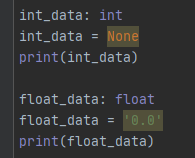

# 型ヒント（Python）
- 型定義を持たない（動的型付け）のPython専用の考え方のため、他の言語で使える技術ではない
- また正確にはテストではない


## 型ヒントとは
- Pythonは動的型付け言語のため、型の定義はできない
- 型ヒント（Type Hints）とは型に関する注釈(型アノテーション)をつけること。
- Python3.5 から利用可能


## mypyとは
- Pythonコード上の `型` を静的解析してくれるツール
- 型ヒントをベースに、正しい方かどうかをチェックする
- 型ヒントが書かれていない場合は、mypyはチェックしない

```python
def greeting_without_type_hint(name):
    """
    型ヒントなし記述。
    mypyでは無視される
    """
    return 'Hello ' + name


def greeting_with_type_hint(name: str) -> str:
    """
    型ヒントあり記述。
    mypyでチェックされる
    """
    return 'Hello ' + name
```

- `変数: 型`の形で型ヒントを書く
- 関数の返り値は `-> 型`の形で書く
- 上記の例はnameはstr型、returnされるのはstr型

### 特徴
- 型ヒントは処理に影響せず、***プログラム実行時には無視される***。（あくまでヒント）
- プログラムを書く際の手助けと、ドキュメンテーションとして可読性を上げる
- ***事前の静的解析***で型異常がないかをチェックできる

    - PyCharmでは画面上で型異常がチェックできる    
      


## 使用方法
### 一般的な使い方
```python
def greeting_with_type_hint(name: str) -> str:
    """
    型ヒントあり記述。
    mypyでチェックされる
    """
    return 'Hello ' + name

# 1. name: str に文字列を入れる場合
greeting_with_type_hint("test")

# 2. name: str にintを入れる場合
greeting_with_type_hint(10)

# 3. name: str にバイナリを入れる場合
greeting_with_type_hint(b'greeting_with_type_hint')

```

- 実行すると、2. と 3. の呼び出しでエラーが出るエラーが出る
```shell script
$ mypy  lec09_mypy_function.py

lec09_mypy_function.py:20: error: Argument 1 to "greeting_with_type_hint" has incompatible type "int"; expected "str"
lec09_mypy_function.py:23: error: Argument 1 to "greeting_with_type_hint" has incompatible type "bytes"; expected "str"
Found 2 errors in 1 file (checked 1 source file)

```

### 返り値の存在チェック
```python
def greeting_with_no_return(name: str) -> None:
    """
    何も返さない関数
    """
    print('hello' + name)


# 返り値(return)が無い関数の値を入れようとしてもエラーが出る
no_return = greeting_with_no_return("Bill")
```

```shell script
$ mypy lec09_mypy_function.py
lec09_mypy_function.py:35: error: "greeting_with_no_return" does not return a value
Found 1 error in 1 file (checked 1 source file)
```


### 計算できない型間違い
```python
def different_type(num: int):
    """
    型計算間違い
    """
    return num + 'x'
```

```shell script
$ mypy lec09_mypy_function.py
lec09_mypy_function.py:42: error: Unsupported operand types for + ("int" and "str")
Found 1 error in 1 file (checked 1 source file)
```

## mypyの設定
- mypyはカレントディレクトリのmypy.ini (あるいはsetup.cfg) で設定する（詳細は公式）
- ライブラリをimportすると`error: Skipping analyzing '{パッケージ名, 例えばnumpy}': found module but no type hints or library stubs`
エラーが良くでる
- パッケージ単位で`ignore_missing_imports = True`をmypy.iniに追加し、無視する設定が良い

```text
[mypy-numpy]
ignore_missing_imports = True

[mypy-scipy.*]
ignore_missing_imports = True
```

# 型定義

## データ型で定義

|名称|型|
|---|---|
|整数|int|
|浮動小数点数|float|
|文字列|str|
|バイト型|bytes|
|真理値|bool|
|None|None|

## コンテナ系

コンテナ系は、内包する型を指定するので、 `list[int]` などと表記を行いたい。しかし、これはPythonの文法エラーとなってしまう。その為に、typingでは専用の型を準備している

```python
from typing import List, Tuple, Dict, Set
```

|名称|型|定義例|
|---|---|---|
|リスト|List|List[int]|
|タプル|Tuple|Tuple[int, int] / Tuple[int, ...]|
|辞書|Dict|Dict[str, int]|
|セット|Set|Set[int]|

```python:containerType.py
list_container: List[int]
list_container = [1, 2, 3, 4]
print(list_container)

dict_container: Dict[str, int]
dict_container = {'X': 1, 'Y': 2}
```

## 特殊な型


```python
from typing import Any
```

|名称|型|定義例|
|---|---|---|
|なんでもいい|Any|Any|


```python

from typing import Callable, Iterator, MutableMapping
```

|名称|型|定義例|
|---|---|---|
|呼び出し可能|Callable|Callable[[int, float], bool]|
|繰り返し可能|Iterator|Iterator[int]|
|辞書のような挙動|MutableMapping|MutableMapping[str, int]|


# その他

## Optional

- Optionalは、指定の型 or Noneを、許容する型
- 例えば、整数とNoneのいずれかを許容する場合は、 `Optional[int]` とする


```python
from typing import Optional

def f1(a: int, b: int) -> Optional[int]:
    if b == 0:
        return None
    return a // b
```

- 便利なのは以下の様に使えるからです。

    ```python
    def f2(c: Optional[int]) -> int:
        if c is None:
            c = 0
        return c + 100
    ```

    上記のケースを以下の様に記載すると、mypyがエラーを通知します。

    ```python
    def f2(c: Optional[int]) -> int:
        return c + 100
    ```

    ```
    $ mypy sample.py 
    sample.py:**: error: Unsupported operand types for + ("None" and "int")
    sample.py:**: note: Left operand is of type "Optional[int]"
    Found 1 error in 1 file (checked 1 source file)
    ```


- つまり、`int`と`None`の両方を受け付けることが可能なのに、`None`が入ってきた場合の処理がないため、エラーを出してくれる

## Union

- Unionは、2つのいずれかの型を示すことができます。
- 例えば、整数型 or 文字列型 と言った場合に、 `Union[int, str]` と指定します。

- 以下の様に引数を受け取るときに、整数か文字列かが分からないような場合に使い、 `isinstance` を使って処理を分けることで、上記のOptional同様に、変数の型を確定させる事ができます。

```python
from typing import Union

def f3(d: Union[int, str]) -> str:
    if not isinstance(d, str):
        d = str(d)
    return d.upper()
```

- ここでは、 `if not isinstance(d, str):` として、変数dが文字列型(str)でないときに、文字列に変換する処理を入れて処理を継続
- `return d.upper()` で、 `d` が文字列であることが分かっているので、安全に大文字に変換する文字列型のメソッドが使えています。


# Pydantic
- Python 用のデータシリアライズ・バリデーションライブラリ
- データをいい感じに適切にオブジェクト化して、データに対しては型ヒントに基づく検証を実施してくれるツール
- mypyと組み合わせることで、かなり高度なチェックが可能となる
- 詳細は下記参照    
     https://dev-growi.aw-connected.com/TecInfo/00.Python_Programing/00.コードスタイル/06.Pydantic